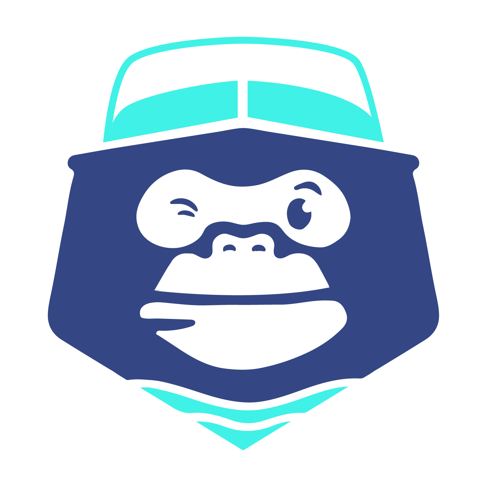

<p align="center">
  
</p>

<h1 align="center">El Mono Loneria Naval</h1>

<p align="center">
  <em>Lonería naval a medida en Tigre, Buenos Aires — lonas, capotas, cerramientos y fundas hechas a mano.</em>
</p>

<p align="center">
  <a href="https://elmonoloneria.com/"><strong>elmonoloneria.com</strong></a>
</p>

---

## Quick Start

```bash
pnpm install        # install deps
pnpm dev            # dev server (Vite, default :5173)
pnpm build          # type-check (tsc -b) + production build
pnpm preview        # preview the production build locally
pnpm test           # vitest watch mode
pnpm test:run       # vitest single run (CI)
pnpm test:coverage  # coverage report (v8 provider)
pnpm lint           # ESLint on .ts/.tsx
```

Requires **Node 22** and **pnpm 11** (pinned in the deploy workflow).

## Stack

| Tech | Version | Uso |
|---|---|---|
| React | 19.2 | UI framework (functional + hooks) |
| TypeScript | ~6.0 | type system, strict (`noUnusedLocals`, `noUnusedParameters`, `verbatimModuleSyntax`, `erasableSyntaxOnly`) |
| Vite | 8.0 | dev server + bundler |
| `@tailwindcss/vite` + Tailwind CSS | 4.3 | estilos via `@theme` tokens in `src/index.css` |
| react-router-dom | 7.18 | client-side routing, lazy-loaded route chunks |
| @radix-ui/react-accordion + dialog | latest | a11y primitives for accordion + modal |
| @tabler/icons-react | 3.44 | icon set (UI + DevBadge) |
| framer-motion · gsap · motion | latest | animations + gestures (DevBadge tooltip, hero scroll-cue, etc.) |
| maplibre-gl + react-map-gl | latest | map (workshop location on Contact) |
| react-player | latest | media player (hero videos + works showcase) |
| Vitest + @testing-library/react + jsdom | 4 / 16 / 29 | tests, jsdom env, `@testing-library/jest-dom` matchers |

**React Compiler** is enabled via `@rolldown/plugin-babel` + `babel-plugin-react-compiler` — write idiomatic React, the compiler handles memoization.

## Estructura

```
src/
├── assets/
│   ├── backgrounds/    SVG decorative patterns (olas, lineas onduladas, ...)
│   ├── fonts/          33 self-hosted TTF files (Brown Beige, Nord, Poppins)
│   ├── img/            product + works photos, dev badge avatar
│   └── logos/          El Mono isotipo + brand partner logos
├── components/
│   ├── common/         cross-cutting primitives
│   ├── layout/         Header · Footer · Hero
│   └── ui/             28 typed components (Button, Card, SectionWrapper,
│                       Accordion, Modal, Masonry, NextPageCta, DevBadge, ...)
├── hooks/              custom React hooks
├── lib/                pure utilities
├── mocks/              typed mock data (data.ts)
├── pages/              Home · Products · Works · AboutUs · Faq · Contact
├── routes/             PATHS constant (single source of truth)
├── test/               Vitest setup (ResizeObserver + IntersectionObserver + matchMedia polyfills)
├── types/              shared types
├── App.tsx             Header (sticky) + ScrollToTop + Routes + Footer (global)
├── main.tsx            createRoot + BrowserRouter
└── index.css           Tailwind v4 `@theme` (colors + fonts)
```

## Features

The site is built around a single conversion path: pick what you want → reach out on WhatsApp → we confirm at the workshop. No forms, no logins, no e-commerce.

- **`/` Home** — Hero with gradient + decorative SVG overlay + dual CTAs to Productos and Trabajos, brand partner marquee, split cards (¿Qué ofrecemos?), masonry works preview, About Us, testimonials, FAQ, location map.
- **`/productos` Productos** — catalog with category filter (`?categoria=...`), live selection cart, **WhatsApp deep-link pre-filled with the current selection** (`buildWhatsAppUrl`), disabled state when the message exceeds the WhatsApp URL length limit (`WHATSAPP_URL_MAX_LENGTH`).
- **`/trabajos` Trabajos** — works showcase (categoria / hash routing, masonry album with `?imagen=` photo deep-links, "Cargar más" pagination), per-proyecto detail with category filter and history-backed state.
- **`/nosotros` Nosotros** — full-bleed gallery of the Tigre workshop, three CountUp stats (years / projects / clients), full content from typed mock data.
- **`/faq` Faq** — bubble filter (Insumos · Servicios · Tiempos · Trabajos), Radix Accordion, search-as-you-type.
- **`/contacto` Contacto** — MapLibre map of the workshop location + contact items + WhatsApp CTA.
- **Bottom-of-route CTA** — `NextPageCta` renders at the bottom of every page, linking to the next route in canonical order with a per-route Tabler icon and a `dark` / `light` variant for chalk vs navy host sections.
- **DevBadge** signature in the footer — `Lautaro Camejo` (Frontend Developer) mark with LinkedIn + WhatsApp hover-tooltip, photo avatar (compressed 357 KB → 1.5 KB webp), courtesy dev attribution.

## Variables de entorno

| Variable | Description |
|---|---|
| `VITE_WHATSAPP_URL` | WhatsApp deep link with the preset greeting. Stored in `.env` (gitignored, local-only). `vite.config.ts` ships a deterministic CI fallback so tests don't depend on it. |

## Testing

- **355 tests passing** across 12 co-located `*.test.tsx` files.
- **Coverage** (v8): ~83% statements · ~73% branches · ~82% functions · ~89% lines.
- **Thresholds** (enforced by `vite build`): 75/65/75/80 — defined inline in `vite.config.ts` so a regression fails the build but a small edit doesn't.
- **Excluded from coverage**: barrel files (`index.ts`), `*.types.ts`, stub pages, `ScrollToTop`, `Header`, `App.tsx`.
- Components using `<Link>` need a `MemoryRouter` wrapper around the render.
- `describe` / `it` / `expect` / `vi` are available globally (no imports needed via `vitest/globals`).

## Deploy

`main` branch pushes trigger [`.github/workflows/deploy.yml`](.github/workflows/deploy.yml):

1. `pnpm install --frozen-lockfile`
2. `pnpm build`
3. `cloudflare/wrangler-action@v3` → `pages deploy ./dist --project-name=elmonoloneria`

Live at **[elmonoloneria.com](https://elmonoloneria.com/)** via Cloudflare Pages.

SEO setup: per-page meta via the `useDocumentMeta` hook (title, description, og, twitter, canonical), JSON-LD `LocalBusiness` schema in `index.html`, sitemap.xml and robots.txt served from `public/`.

## Design system

Tokens defined in `src/index.css` via Tailwind v4 `@theme`:

| Token | Hex | Uso |
|---|---|---|
| `pr-hero-blue` | `#344784` | hero gradient end, eyebrow text on chalk |
| `pr-aquamarine` | `#40F1E7` | accent — link active, brand mark, dots |
| `sc-ocean-blue` | `#001051` | header / footer / dark sections, text on chalk |
| `sc-chalk` | `#F4F4F4` | section backgrounds, body text on dark |

Typography is fluid — `clamp()` over breakpoint jumps (e.g. `text-[clamp(1.8rem,3.5vw,2.8rem)]`). The only explicit breakpoint is the 800px mobile sidebar toggle; grid breakpoints are `md:grid-cols-2` / `lg:grid-cols-3`.

All fonts are self-hosted TTF — no CDN.

---

## License

Proprietary — all rights reserved. See [LICENSE](./LICENSE).

---

<p align="center">
  Built and maintained by <a href="https://www.linkedin.com/in/lautaro-camejo-837339247/">Lautaro Camejo</a><br />
  <sub>First public release — v1.0</sub>
</p>
